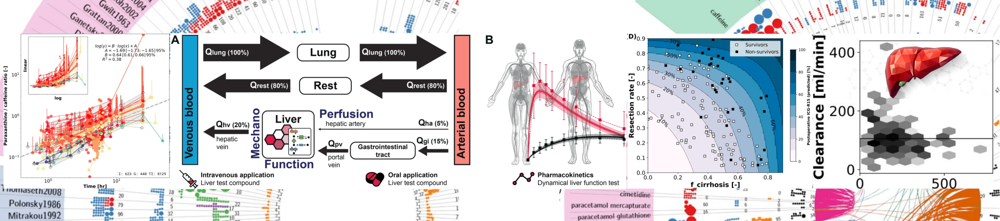

# König Lab – Systems Medicine for Advanced Drug Metabolism and Liver Studies

Welcome to the GitHub space of **Matthias König** and the [**König Lab**](https://livermetabolism.com), where we integrate **Systems Medicine** and **Systems Biology** to unravel the complexities of drug metabolism and liver function.

By combining **computational modeling**, **data science**, **bioinformatics**, and **machine learning**, we bridge biology, medicine, and clinical data to enable predictive, personalized healthcare solutions.

## 🔬 Core Research Avenues

- **📈 Predictive Biomedical Modeling**  
  Focused on the **liver** and **kidneys**, we develop mechanistic models to predict system behaviors under various physiological and pathological conditions.

- **🧍‍♂️ Digital Twins Development**  
  We build **physiologically based pharmacokinetic/pharmacodynamic (PBPK/PD)** models—virtual representations of individuals—to simulate and understand drug response variability.

- **🧪 Reproducibility & Open Research**  
  Transparent, traceable, and collaborative science is central to our mission. We promote **open-source tools**, **versioned workflows**, and **reproducible computational pipelines**.

- **📂 FAIR Data & Workflows**  
  We rigorously apply FAIR principles—**Findable, Accessible, Interoperable, and Reusable**—to all our data, tools, and workflows.

## 🧍‍♀️🧍‍♂️ Predictive Digital Twins

A central focus of our work is the creation of **predictive digital twins**—virtual patient models tailored to individual physiology. These models help:

- Understand **inter-individual variability** in drug response.
- Support **precision dosing** strategies.
- Explore the impact of **lifestyle and disease** on drug metabolism and treatment outcomes.

## 📚 Learn More

Explore our [publications](https://livermetabolism.com/publications), [projects](https://livermetabolism.com/projects), and repositories to dive deeper into our research and contributions.

🔗 **Contact & Collaboration**  
Interested in collaborating or learning more? Get in touch via our [lab website](https://livermetabolism.com) or check out the ongoing research right here on GitHub.
