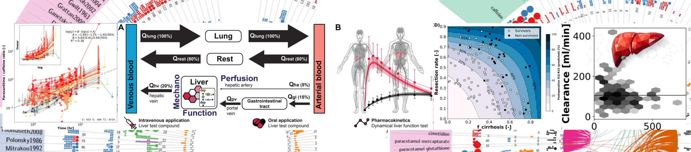

<!-- Generated by site/scripts/render-readme.ts from the same data as matthiaskoenig.github.io. Edit the template there, not this file. -->

# Prof. Dr. Matthias König

Research software engineering for systems medicine: open-source tools, standards and reproducible workflows for digital twins of the liver and human physiology. Professor of Metabolic Inflammation and Carcinogenesis of the Liver at the [University of Lübeck](https://www.uksh.de/) (UKSH, Campus Lübeck) and head of the [König Lab](https://livermetabolism.com) at Humboldt-Universität zu Berlin.

🔗 **[matthiaskoenig.github.io](https://matthiaskoenig.github.io)** (software overview with interactive charts) · [livermetabolism.com](https://livermetabolism.com) · [ORCID](https://orcid.org/0000-0003-1725-179X) · [CV](https://livermetabolism.com/cv/)

## 🔬 Research interests

- 🧊 **[Digital Twins](https://livermetabolism.com/research/?tag=Digital%20Twins)** — Mechanistic, patient-specific models spanning molecule to whole body that mirror an individual's physiology, enabling simulation-based prediction of disease progression and treatment response.
- 💓 **[AI](https://livermetabolism.com/research/?tag=AI)** — Machine learning combined with mechanistic modeling to extract patterns from complex biomedical data and support predictive, personalized decision-making in medicine.
- 🖼️ **[Digital Pathology](https://livermetabolism.com/research/?tag=Digital%20Pathology)** — Computational and AI-driven analysis of whole-slide histology images to quantify tissue structure, zonation, and disease patterns at scale.
- 📈 **[Pharmacometrics](https://livermetabolism.com/research/?tag=Pharmacometrics)** — Physiologically based pharmacokinetic and pharmacodynamic (PBPK/PD) modeling of drug absorption, distribution, metabolism, and excretion to support precision dosing.
- 🔓 **[Open & FAIR](https://livermetabolism.com/research/?tag=Open%20%26%20FAIR)** — Open, FAIR (Findable, Accessible, Interoperable, Reusable), and reproducible models, data, and software that the research community can build on.

## 💻 Main projects

| | Project | Latest release | Language | License | Links |
|---|---|---|---|---|---|
|  | **[PK-DB](https://github.com/matthiaskoenig/pkdb)** Pharmacokinetics database | [v0.9.8](https://github.com/matthiaskoenig/pkdb/releases/tag/v0.9.8) 6 Oct 2025 | Python | MIT | [Website](https://alpha.pk-db.com) · [Zenodo](https://doi.org/10.5281/zenodo.1406979) · [Paper](https://doi.org/10.1093/nar/gkaa990) |
|  | **[sbmlutils](https://github.com/matthiaskoenig/sbmlutils)** Python utilities for SBML | [0.10.2](https://github.com/matthiaskoenig/sbmlutils/releases/tag/0.10.2) 8 Sept 2026 | HTML Python 3.11–3.14 | MIT | [Docs](https://matthiaskoenig.github.io/sbmlutils) · [Zenodo](https://doi.org/10.5281/zenodo.597149) |
|  | **[sbmlsim](https://github.com/matthiaskoenig/sbmlsim)** SBML simulation made easy | [0.6.1](https://github.com/matthiaskoenig/sbmlsim/releases/tag/0.6.1) 10 Sept 2026 | Python Python 3.13–3.14 | MIT | [Docs](https://matthiaskoenig.github.io/sbmlsim/) · [Zenodo](https://doi.org/10.5281/zenodo.597149) |
|  | **[pymetadata](https://github.com/matthiaskoenig/pymetadata)** Metadata and COMBINE archives in Python | [0.6.2](https://github.com/matthiaskoenig/pymetadata/releases/tag/0.6.2) 8 Sept 2026 | Python Python 3.11–3.14 | MIT | [Docs](https://matthiaskoenig.github.io/pymetadata) · [Zenodo](https://doi.org/10.5281/zenodo.5308801) |
|  | **[libsbgnpy](https://github.com/matthiaskoenig/libsbgnpy)** Python library for SBGN | [0.6.1](https://github.com/matthiaskoenig/libsbgnpy/releases/tag/0.6.1) 7 Sept 2026 | JavaScript Python 3.11–3.14 | MIT | [Docs](https://matthiaskoenig.github.io/libsbgnpy) · [Zenodo](https://doi.org/10.5281/zenodo.22642321) |
|  | **[VisFEM](https://github.com/matthiaskoenig/visfem)** Web visualization of FEM models | [0.1.0](https://github.com/matthiaskoenig/visfem/releases/tag/0.1.0) 5 May 2026 | Python Python 3.13–3.14 | MIT | [Docs](https://matthiaskoenig.github.io/visfem) · [Zenodo](https://doi.org/10.5281/zenodo.19220183) |
|  | **[cy3sbml](https://github.com/matthiaskoenig/cy3sbml)** SBML for Cytoscape 3 | [v0.5.0](https://github.com/matthiaskoenig/cy3sbml/releases/tag/v0.5.0) 21 Oct 2025 | Java | — | [Zenodo](https://doi.org/10.5281/zenodo.17406771) |

- **PK-DB** — The first FAIR-compliant open database for pharmacokinetics, integrating clinical and pre-clinical trial data. PK-DB enables reproducible PBPK/PD modeling and individualized simulations and has become a key infrastructure for computational pharmacology research.
- **sbmlutils** — A versatile Python library that streamlines working with SBML models: model creation, annotation, reports, and integration with libSBML. Widely used in reproducible modeling workflows across systems biology.
- **sbmlsim** — A lightweight Python package that simplifies simulations of SBML models on top of libRoadRunner: timecourses, scans, parameter fitting and reports, lowering the entry barrier for model testing and teaching.
- **pymetadata** — Python utilities for working with metadata, ontologies and identifiers, and for reading and writing COMBINE archives, so that models and data carry the annotations that make them FAIR.
- **libsbgnpy** — A Python library for the Systems Biology Graphical Notation (SBGN), supporting standardized visualization and exchange of pathway maps.
- **VisFEM** — A browser-based visualization tool for finite element method (FEM) simulation results, making FEM-based digital twin models interactively explorable and shareable directly from the web.
- **cy3sbml** — A widely used Cytoscape app for the visualization of SBML models in network contexts, enabling intuitive exploration of complex models in systems biology and bioinformatics.

## 🚀 Latest releases

-  **sbmlsim** [0.6.1](https://github.com/matthiaskoenig/sbmlsim/releases/tag/0.6.1) · 10 Sept 2026 — library code does not show figures. sbmlsim.sensitivity.plots.heatmap and S1_ST_barplot return the matplotlib.figure.Figure they create and close it instead of calling plt.show()…
-  **sbmlutils** [0.10.2](https://github.com/matthiaskoenig/sbmlutils/releases/tag/0.10.2) · 8 Sept 2026 — antimony 3.2.0 is excluded on Windows: its wheel raises OSError: [WinError -529697949] Windows Error 0xe06d7363 in loadAntimonyString when parsing the antimony of the…
-  **pymetadata** [0.6.2](https://github.com/matthiaskoenig/pymetadata/releases/tag/0.6.2) · 8 Sept 2026 — EntryFormat.ANTIMONY for Antimony model files in COMBINE archives (text/plain) · every change goes into develop through a pull request; the tests, ruff, ty and the documentation…
-  **sbml4humans** [0.2.0](https://github.com/matthiaskoenig/sbml4humans/releases/tag/0.2.0) · 7 Sept 2026 — The first release of sbml4humans from its own repository. Until sbmlutils 0.10.0 the application lived in the sbmlutils repository, the backend api was sbmlutils.report.api with…
-  **libsbgnpy** [0.6.1](https://github.com/matthiaskoenig/libsbgnpy/releases/tag/0.6.1) · 7 Sept 2026 — the validation documentation walks through an invalid document: examples/sbgn/invalid.sbgn breaks the schema in three ways, one per kind of error the validation reports, and the…
- **opencobra/cobrapy** [0.32.1](https://github.com/opencobra/cobrapy/releases/tag/0.32.1) · 11 Aug 2026 — fixed import failure when hopsy was not installed
-  **sys-bio/roadrunner** [v2.10.0](https://github.com/sys-bio/roadrunner/releases/tag/v2.10.0) · 5 Aug 2026 — Major new capability: variable stoichiometries. · Support for variable stoichiometries is now present and should be complete: all the SBML Test Suite cases with variable and named…
-  **VisFEM** [0.1.0](https://github.com/matthiaskoenig/visfem/releases/tag/0.1.0) · 5 May 2026 — first working prototype
-  **sys-bio/tellurium** [v2.2.11.2](https://github.com/sys-bio/tellurium/releases/tag/2.2.11.2) · 5 Dec 2025 — Small fix to SED-ML handling of files with paths. SimpleSEDML should now work on Windows.
-  **cy3sbml** [cy3sbml-v0.5.0](https://github.com/matthiaskoenig/cy3sbml/releases/tag/v0.5.0) · 21 Oct 2025 — fixed deprecation issues with HTML escape · release documentation added to repository · Fix ':' in network names · Update OLS to OLS4, #353 (@kyxhik) · fixing url patterns and…
- **pkdb_analysis** [0.3.1](https://github.com/matthiaskoenig/pkdb_analysis/releases/tag/0.3.1) · 20 Oct 2025 — warnings to info on pharmacokinetics calculation · support python 3.10, 3.11, 3.12, 3.13 · updated build system with uv and ruff · fixed tests
-  **PK-DB** [pkdb-v0.9.8](https://github.com/matthiaskoenig/pkdb/releases/tag/v0.9.8) · 6 Oct 2025 — updated code licensing to MIT · removed travis · uv installation · updated postgres to version 18 · python update to py3.9 and pinned versions for stability

## 📊 Activity

28 repositories · 983 stars · 1089 commits and 72 pull requests in the last year · primary language Python in 9 repositories. Contribution calendar, release timeline and the full repository catalog: [matthiaskoenig.github.io](https://matthiaskoenig.github.io).

## 📚 Learn more

Publications, projects, team and teaching of the König Lab: [livermetabolism.com](https://livermetabolism.com) ([publications](https://livermetabolism.com/publications), [projects](https://livermetabolism.com/projects)). Interested in collaborating? Get in touch via the lab website.

---

Generated from GitHub data fetched on 2026-09-10; refreshed weekly by the <em>Update profile README</em> workflow. This repository also holds the source of the site under <a href="./site">site/</a> (see <a href="./site/README.md">site/README.md</a>).
